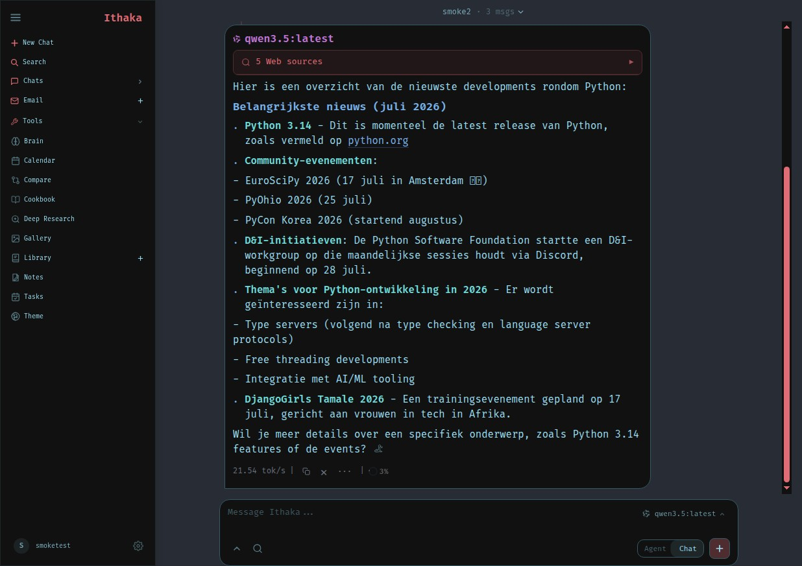

<h1 align="center">Ithaka</h1>

<p align="center">
  A self-hosted AI workspace for chat, agents, research, documents, email, notes, calendar, and local model workflows.
</p>

<p align="center">
  <a href="https://github.com/EdF2021/ithaka/actions/workflows/ci.yml"></a>
  <a href="LICENSE"></a>
  
  
</p>

<p align="center">
  <a href="#quick-start">Quick Start</a> ·
  <a href="#features">Features</a> ·
  <a href="docs/setup.md">Setup Guide</a> ·
  <a href="CONTRIBUTING.md">Contributing</a> ·
  <a href="ROADMAP.md">Roadmap</a>
</p>

<p align="center">
  
</p>

Everything runs on your own hardware: one Docker Compose stack bundles the app with a vector store (ChromaDB), metasearch (SearXNG), and notifications (ntfy). Bring your own models — local via Ollama or the built-in Cookbook, or any API provider.

## Quick Start

> `dev` is the default branch and gets the newest changes first. Use [`main`](https://github.com/EdF2021/ithaka/tree/main) if you want the more curated branch.

```bash
git clone https://github.com/EdF2021/ithaka.git
cd ithaka
cp .env.example .env
docker compose up -d --build
```

Open `http://localhost:7000` when the containers are healthy. The first admin password is printed in `docker compose logs ithaka`.

Native installs, GPU notes, Windows/macOS instructions, HTTPS, and configuration live in the [setup guide](docs/setup.md).

## Features

| | |
|---|---|
| **Chat + Agents** | Local and API models with tools, MCP, file uploads, shell access, skills, and persistent memory. |
| **Notebooks** | NotebookLM-style workspaces: upload or web-search sources, chat strictly grounded with citations, and generate study guides, briefings, quizzes, mindmaps, flashcards, slide decks, infographics, data tables, podcasts, and narrated video overviews. |
| **Deep Research** | Multi-step web research with source reading and report generation. |
| **Cookbook** | Hardware-aware model recommendations, downloads, and local serving. |
| **Compare** | Blind side-by-side model testing and synthesis. |
| **Documents** | Writing-first editor with AI edits, suggestions, Markdown, HTML, CSV, and syntax highlighting. |
| **Email** | IMAP/SMTP inbox with triage, tags, summaries, reminders, and reply drafts. |
| **Notes, Tasks + Calendar** | Reminders, todos, scheduled agent tasks, and CalDAV sync. |
| **Extras** | Gallery and image editor, themes, uploads, web search, presets, sessions, and 2FA. |

## Demo

A full hover-to-play tour lives on the landing page: [`docs/index.html`](docs/index.html) (open it locally in a browser).

## Architecture

FastAPI backend with a vanilla-JS frontend — ES modules, no framework, no build step. RAG runs on ChromaDB, web search through SearXNG, and remote access through an optional Tailscale sidecar. A deeper runtime inventory lives in [`specs/architecture-runtime-inventory.md`](specs/architecture-runtime-inventory.md); operational guides (setup, backup/restore, security CI) in [`docs/`](docs).

## Contributing

Help is welcome. The best entry points are fresh-install testing, provider setup bugs, mobile/editor polish, docs, and small focused refactors. See [CONTRIBUTING.md](CONTRIBUTING.md) and [ROADMAP.md](ROADMAP.md).

## Security

Ithaka is a self-hosted workspace with powerful local tools. Keep auth enabled, keep private data out of Git, and do not expose raw model/service ports publicly. Deployment details are in the [setup guide](docs/setup.md#security-notes).

## License

Copyright (C) 2026 Ed de Feber.

AGPL-3.0-or-later -- see [LICENSE](LICENSE). Ithaka builds on Odysseus and other third-party work; original copyrights remain with their authors -- see [ACKNOWLEDGMENTS.md](ACKNOWLEDGMENTS.md).
